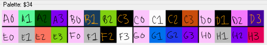

# ad-API
Alter Dark API

## Usage
`GET https://alterdark.azurewebsites.net/api/` with paramaters listed in maps below.

## Maps
 - [Alter Dark](#alter-dark-map)

### Alter Dark map
| param       | example value | notes                   |
| ----------- | ------------- | ----------------------- |
| "rom"       | "AlterDark"   |
| "bgpala0" ... "bgpalh3"   | 0x3C | see palette param naming convention below.  first row (a0 through d3) contain background colors; second row (e0 through h3) contain sprite colors. all x0 colors (a0, b0, h0, etc.) must be the same value. e0, f0, g0, and h0 represent transparency and will not be visible. |
| "anim"      | 0x01          | 0x00 = none, 0x01 = aliens, 0x02 = hearts |
| "animspeed" | 0x01          | 0x01 = slow, 0x02 = med, 0x04 = fast |
| "randomseed1" "randomseed2" | 0xFA        | used for generating random colors and positions in nes rom. generate in javascript: `randomseed1 = Math.floor(Math.random() * 256);` |
| "text1_1" ... "text2_28" | "H" | supports ascii values 0x20 through 0x7E. see [ascii-table.com](http://ascii-table.com/). |
 
 
